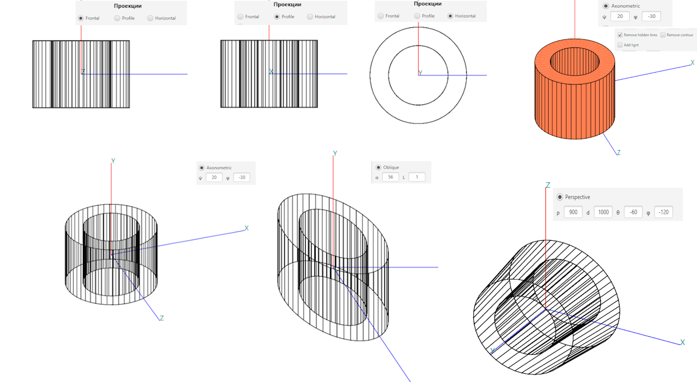

# 3D-cylinder-draw
This project was created while studying in university BNTU 3 course 1-semestr, as course working by 3d-modeling
JAVA FX

> Main purpose this project is presentation 3d object on the 2d planes.
In this case as a approximation of the object was taken **cylinder**.

## Project implementation requirement:
- #### Approximation cylinder;
- #### Geometrical transformation;
- #### All kinds projections 3d-cylinder on the 2d planes:
- #### Lighting by a light source

>### Approximation cylinder
For designing 3d-cylinder on the 2d planes was using degree approximation via specified variable `N`.
Algorithm approximation of the cylinder see method [Cylinder#approximationVertex()](src/main/java/models/Cylinder.java).
Also, all set units that using for implementation see [package](src/main/java/models)

>### Geometrical transformation
###### Main kinds transformation:
- moving by `Ox`, `Oy` `Oz` axis
- Scaling by `Ox`, `Oy` `Oz` axis
- Rotating by `Ox`, `Oy` `Oz` axis

Realization geometric transformation see [DrawWays.GeometricTransformations](src/main/java/rendering/DrawWays.java)
For example:

>### All kinds projections 3d-cylinder on the 2d planes
- Frontal projection,
- Profile projection,
- Horizontal projection,
- Axonometric projection,
- Oblique projection,
- Perspective projection.

All projection you can see

Matrix representation wrote here [MatRix.java](src/main/java/toolkit/MatRix.java)
 
Algorithms projections wrote here [DrawWays.Projections](https://github.com/IlyaGorbachov7/3D-cylinder-draw/blob/7f099ca2644141b3a75fa96f3a3e751e1b79df5e/src/main/java/rendering/DrawWays.java#L376)

>### Lighting by a light source

 
You can delete contours cylinder
 

Algorithms lighting wrote here [src/main/java/toolkit/ToolsFillingSurfacesCylinder#getBrightness](https://github.com/IlyaGorbachov7/3D-cylinder-draw/blob/7f099ca2644141b3a75fa96f3a3e751e1b79df5e/src/main/java/toolkit/ToolsFillingSurfacesCylinder.java#L179)